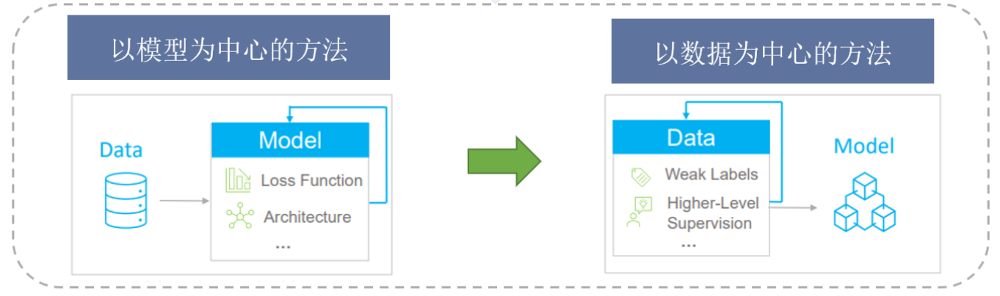
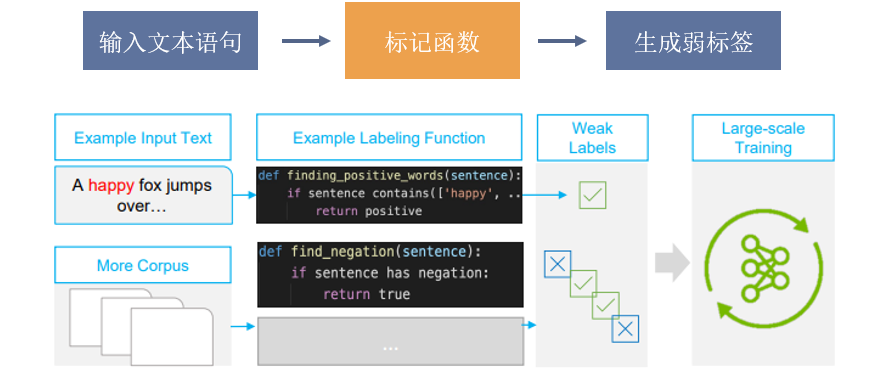
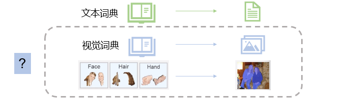
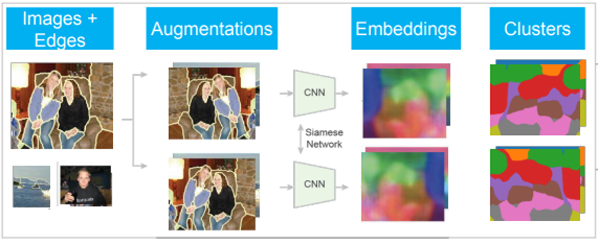
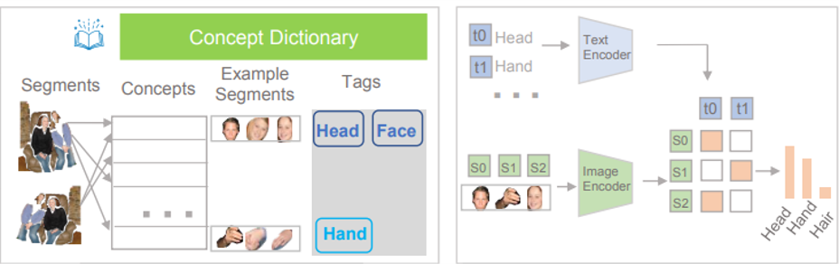
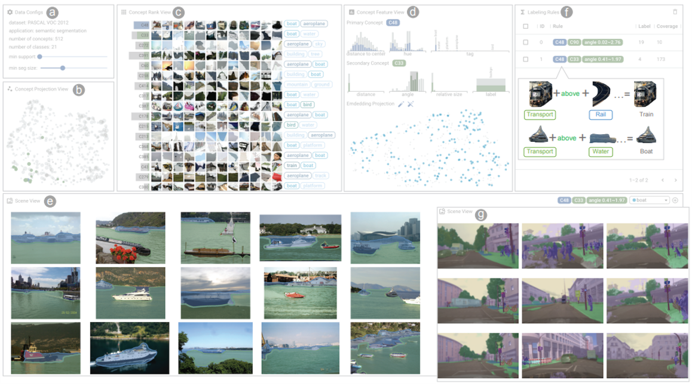
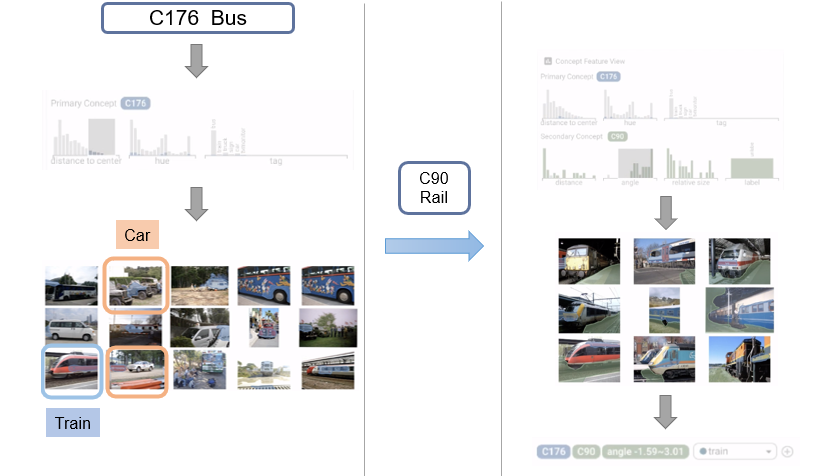

## Abstract

&nbsp;&nbsp;&nbsp;&nbsp;&nbsp;&nbsp;&nbsp;&nbsp;以数据为中心的 AI 已经成为一个新的研究领域。作为以数据为中心的 AI 的核心方法，数据编程帮助专家使用标注函数向数据和标签大范围的注入领域知识。尽管数据编程在 NLP 领域已经取得了巨大的成功，但是在编程图像数据上仍然存在挑战：

- 缺乏人工注释的情况下难以用视觉词汇描述图像；
- 缺乏有效的图像数据编程工具。

&nbsp;&nbsp;&nbsp;&nbsp;&nbsp;&nbsp;&nbsp;&nbsp;本文提出视觉概念编程，利用自监督学习的方法学习并提取视觉概念字典，而无需任何人工标注。并设计交互式可视化探索理解视觉概念，在无需编写代码的情况下组合标记函数，从而大规模标记图像数据。

---

## Introduction

&nbsp;&nbsp;&nbsp;&nbsp;&nbsp;&nbsp;&nbsp;&nbsp;在过去机器学习的进步大多是遵循以模型为中心的方法，比如引入一个数据集，研究人员将一些先验知识（模型架构、损失函数）引入模型，并迭代更新模型来达到预期效果。

&nbsp;&nbsp;&nbsp;&nbsp;&nbsp;&nbsp;&nbsp;&nbsp;在以模型为中心的可视分析中，可解释 AI 是这一思路的一个主要研究方向。他的动机是研究深度学习模型的机制，比如 What-if、LSTMVis、SUMMIT、VASS 等可视分析系统都是促进可解释 AI 原则的解决方案的例子。虽然这些方法被证明对他们的目的是有效的，但是他们主要是为了解释和细化特定任务的模型开发的。

&nbsp;&nbsp;&nbsp;&nbsp;&nbsp;&nbsp;&nbsp;&nbsp;而到了深度学习时代，以模型为中心的方法出现了数据饥渴问题。模型需要更大规模的标注训练数据集。而人工标注是费时费力的，这带来了一定的困难。同时一旦数据与模型组合完成，很难将数据调整到新的领域或者新的目标。虽然目前存在用于数据标记的可视分析如 OneLabeler，但是仍然需要工作人员一个个标记数据实例。因此半监督、自监督的方法逐渐运用到数据标注上。但这些方法往往缺乏一种高效的人类知识的注入。

&nbsp;&nbsp;&nbsp;&nbsp;&nbsp;&nbsp;&nbsp;&nbsp;基于上述问题，当前可视化分析研究的重点逐渐从以模型为中心的 AI 转移到以数据为中心的 AI.

#### 数据编程

&nbsp;&nbsp;&nbsp;&nbsp;&nbsp;&nbsp;&nbsp;&nbsp;数据编程是目前最有前途的以数据为中心的方法之一，它通过领域专家编写标记函数，为数据集生成弱标签。以这种方式分配的标签比单独标记每个训练样本更具可扩展性。
&nbsp;&nbsp;&nbsp;&nbsp;&nbsp;&nbsp;&nbsp;&nbsp;目前，数据编程被证明在 NLP 领域是有效的(eg.情感预测的 NLP 任务)。在这个情境中，通过在句子中搜索具有积极性质的词汇的标记函数，将一个句子标记为是否具有积极情感。同样的，许多其他的函数可以被定义并被应用于大型的语料库。

To call it a Machine Learning Library is perhaps a bit of a stretch, since I just intended to create a **multi-neuron, multi-layered [perceptron](./single-neuron-perceptron.html)**.

---

## Challenge

&nbsp;&nbsp;&nbsp;&nbsp;&nbsp;&nbsp;&nbsp;&nbsp;但在图像数据上，数据编程仍然存在挑战。

- **在没有人工注释的情况下难以用视觉词汇描述图像。** 这与使用有意义的单词进行文本数据编程不同，我们缺少一个用来编程图像数据的视觉词典。比如一个人可以被一组身体部位的概念来定义，包括手，头发，脸等等。
  

- **仍然缺乏有效的图像数据编程工具。** 即使我们有了描述图像中物体和部件的视觉词汇，我们仍然缺乏一个有效的工具去探索、理解并且使用这些视觉概念来进行数据编程。解决生成诸如 face + hand + body = person 这样的一个编程过程。

---

## Contribution

- **视觉概念编程框架**
  - 利用基于自我监督的方法生成视觉概念，将人类知识大规模的注入数据
- **可视分析工具**
  - 允许领域专家探索和理解视觉概念
  - 允许用户交互式地组合、验证和编辑标记函数
- **可用性和有效性**
  - 案例研究
  - 实验

---

## Framework

  

&nbsp;&nbsp;&nbsp;&nbsp;&nbsp;&nbsp;&nbsp;&nbsp;通过自监督的方式提取视觉概念，并利用零样本标记的方式生成视觉词典，从而解决challenge1的问题。

&nbsp;&nbsp;&nbsp;&nbsp;&nbsp;&nbsp;&nbsp;&nbsp;之后，本文设计了一个可视交互系统，用于概念的探索与编程，从而生成新的弱标签，进一步优化模型。

#### 自监督视觉概念提取

主要思想：

- 从边缘检测产生伪片段的图片开始，产生不同的增强，并且输入到 CNN 中去生成一些像素嵌入（一种高维的特征向量）。之后训练 CNN 为具有相似语义的区域生成相似的像素嵌入。训练完成后，利用 K-means 对这些像素嵌入进行聚类，从而对图片进行分割。
- 对于每个分割产生的图像片段，根据像素嵌入和视觉概念之间的距离计算相似性，将相似的图像段分配到一个视觉概念中。
- 通过上述提取过程，得到一组视觉概念，其中每个概念包含一组具有相似语义和嵌入的图像段。
  

#### 视觉概念的零样本视觉语言标注

**模型**：CLIP，一种在大量文本-图像上进行预训练的视觉语言模型，他的目标是为给定的图像生成一个合适的描述。

- 给定一个视觉概念，将相应的图像片段输入到 CLIP 的图像编码器中，
- 通过距离比较图像嵌入与预定义标签嵌入的相似性
- 排序，取前 k 个高频的标签作为这个概念的描述

&nbsp;&nbsp;&nbsp;&nbsp;&nbsp;&nbsp;&nbsp;&nbsp;通过上述步骤得到了一个基于视觉图像的概念词典。视觉概念将作为标记功能的构建模块，引入到可视交互系统中。

  

---

## System

 

A: data configs:这部分展示了数据集和提取的视觉概念的信息。
B：视觉概念投影视图：将视觉概念投影到二维空间，帮助快速找到突出的概念。
C：视觉概念排名视图：与投影视图关联联动，展示概念的排名与进一步的信息。
D：概念特征视图：可视化主要概念的细节以及与可选次要概念之间的关系。
E：场景视图：展示选中概念中的图像片段
F：标注视图：展示用户交互生成的标注规则

##### Case

 

 &nbsp;&nbsp;&nbsp;&nbsp;&nbsp;&nbsp;&nbsp;&nbsp;例如，专家在排名视图选择了C176这个bus的视觉概念，但是通过刷选发现还有一些图像并不是bus，其中也包括了train和car，因此可以通过选择一个带有rail标签的概念来分离train和bus。

&nbsp;&nbsp;&nbsp;&nbsp;&nbsp;&nbsp;&nbsp;&nbsp;专家将 rail 的概念作为次要概念加入，再次进行刷选，得到一个概念标记函数 C176+C90+ angle(between 1.59 and 3.01) = train. 在这个规则的基础上，同样能进行规则的叠加。

---

&nbsp;&nbsp;&nbsp;&nbsp;&nbsp;&nbsp;&nbsp;&nbsp;本文提供了一个新的思路和方法来对数据进行大范围的标注，从数据标签的角度入手来提升模型训练的效果。
